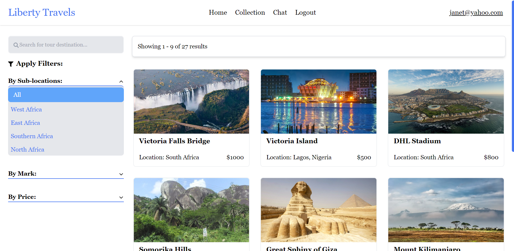

# PROJECT DOCUMENTATION

# LIBERTY TOURS: TOUR AGENCY WEB APPLICATION
### This is a responsive web application. Best viewed on desktop.

## About The Project 

This is a touring agency web application. It is best optimized for desktop view. This app was built to handle the Liberty Tours Agency online operations. Liberty Tours is into the business of taking interested tourists and visitors on tours around some parts of Africa. 

## Web App UI
 

## Technologies, Libraries and Packages Used

- React.js
- Typescript
- CSS and Tailwindcss for styling
- Firebase for Authentication
- React-Paystack Integration for payments
- React-icons and Router
- AOS for animation
- React-slick-carousel library for sliding animations
- React-Spinners for loading animation
- React-Datepicker for displaying dates and time
- React-Toastify for notification pop ups

## App Features

- Home page: The homepage is the default page where users can view everything about the app, the features, gallery blog and so on.
- Registration and Login page: Viewers are however restricted from viewing or interacting with the app's main page until they succesfully register and login to the app. The app was authenticated using Firebase.
- Main Page: After succesfully logging in, users are navigated to the main page. This main page contains all tour destinations available to users. The destination consists of details about the tour site such as images of the site, small info about the site, coordinates, price of the tour. This dstinations have all been categorized into different areas like sub-locations, marks and prices.
- Users can click on any of the tour destination cards to view ore details about the destination site and purchase ticket for the tour. They get to choose number of tickets for purchase, their preferred date and time for the tour. 
- Users having picked their desired tour destination, selected number of tickets and date & time for the tour, can then go ahead to make payment for the tour destination chosen. Paystack API was integrated into the app to provide a payment getway for users to be able to pay for the tickets.
- Tour booked successfully after purchase. 

## Pages🔍

- Home page 
- Registration
- Login
- Main Page/Tour destinations page

## App Links 
Production Link: (https://liberty-tours-a86a1.web.app/)

Project Github Repo Link: (https://github.com/OmaJuliet/Liberty-Tours.git)

## Get it on your local machine
To get this React-Typescript application on your local machine, you need to follow these steps

## Prerequisites
- Node.js (v14.17.6 or later)
- npm (v6.14.15 or later)

### Installation
1. Clone the repository or download the source code from GitHub. To clone it, use this command "git clone repo-link"
2. Open a terminal or command prompt and navigate to the project directory.
3. Run `npm install` to install the project dependencies.

### Other dependencies
- Run `npm install react-router-dom@6` to install the router library
- Run `npm i react-paystack` to install the Paystack library
- Run `npm install firebase` to install the Firebase library

### Running and Testing the application
2. Run `npm start` to start the development server.
3. Open a web browser and go to http://localhost:3000 to view the application.